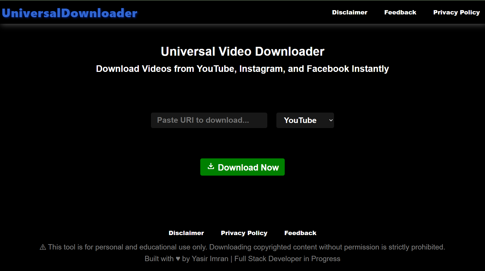
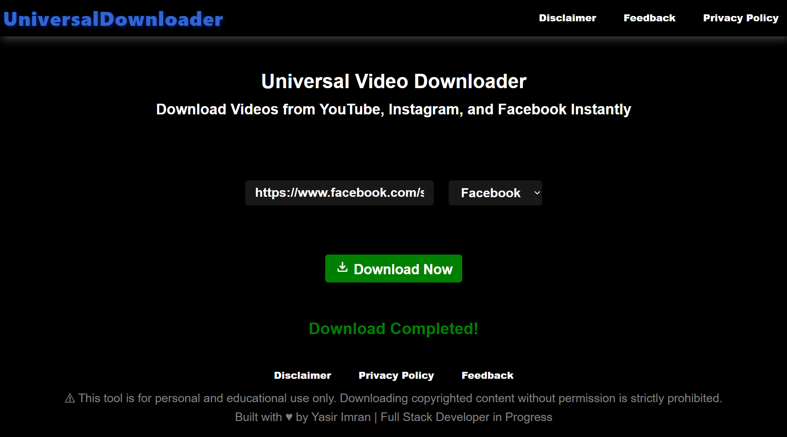
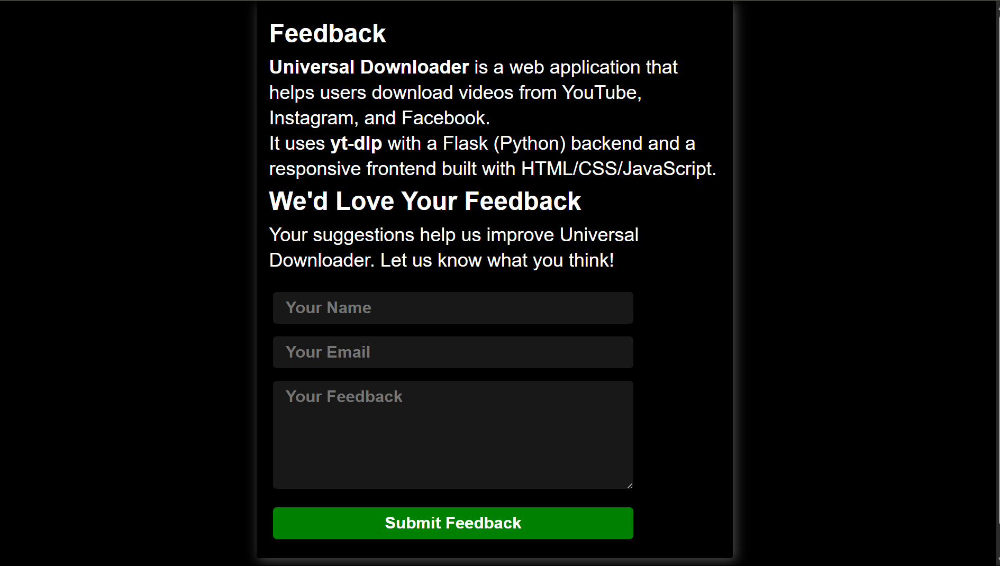

# 📥 Universal Downloader

Universal Downloader is a simple web application built with Flask and `yt-dlp` that allows users to download videos from **YouTube**, **Instagram**, and **Facebook** through a single interface.

---

## 🚀 Features

- 🎥 Download videos from:
  - YouTube
  - Instagram
  - Facebook
- 📱 Responsive UI (HTML, CSS, JS)
- 🧠 Built with:
  - Flask (Python Backend)
  - `yt-dlp` for downloading videos
- 📬 Feedback form (Demo purpose only)

---

## 📸 Screenshots

### 🏠 Home Page



### 💬 Downloade Progress


### Mobile Responsiveness


### 💬 Feedback Page



---

## 🛠 Tech Stack

- **Frontend:** HTML, CSS, JavaScript
- **Backend:** Python (Flask)
- **Downloader:** `yt-dlp`
- **Web Server:** Gunicorn (for deployment)
- **Hosting:** Render

---

## 📝 Disclaimer

> This tool is for **educational purposes only**. It should not be used to download copyrighted or unauthorized content.

---

## 📦 Local Setup

1. Clone the repository:
   ```bash
   git clone https://github.com/YasirDev786/universal-downloader.git
   cd universal-downloader
Create a virtual environment:

     ```bash
     python -m venv venv
     source venv/bin/activate   # On Windows: venv\Scripts\activate

Install dependencies:

    ```bash
    pip install -r requirements.txt
    Run the Flask app:

📬 Feedback
Fill out the feedback form on the site. Data is collected for demo only and is not publicly shared.

🧑‍💻 Author
Yasir Imran

📎 LinkedIn  www.linkedin.com/in/yasir-imran-9192b5359
🐙 GitHub   https://github.com/YasirDev786

